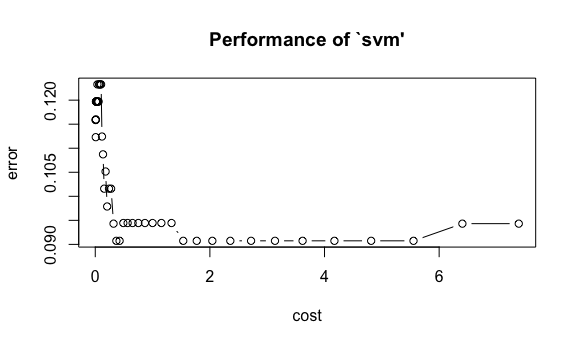
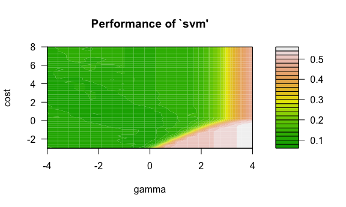

Data Science II Homewrk 5
================
Roxy Zhang
5/4/2022

``` r
knitr::opts_chunk$set(warning = FALSE, message = FALSE, 
                      fig.align = "center", cache = TRUE, 
                      fig.width = 6, fig.asp = 0.6, out.width = "90%")
theme_set(theme_minimal() + theme(legend.position = "bottom"))
```

## Data import and partition

``` r
auto = read_csv("auto.csv") %>% 
  janitor::clean_names() %>% 
  na.omit() %>% 
  distinct() %>% 
  mutate(
    cylinders = as.factor(cylinders),
    origin = case_when(origin == "1" ~ "American",
                       origin == "2" ~ "European",
                       origin == "3" ~ "Japanese"),
    origin = as.factor(origin),
    mpg_cat = as.factor(mpg_cat),
    mpg_cat = fct_relevel(mpg_cat, "low", "high")
  ) %>% 
  as.data.frame()
```

``` r
# split the dataset into two parts: training data (70%) and test data (30%)

set.seed(0504)

indexTrain = createDataPartition(y = auto$mpg_cat,
                                 p = 0.7,
                                 list = FALSE)
```

## Support Vector Machines

### Linear Kernel

Fit a support vector classifier (linear kernel) to the training data.
The linear kernel provides a linear decision boundary.

``` r
set.seed(0504)

# using package e1071
linear_svm = tune.svm(mpg_cat ~ .,
                      data = auto[indexTrain, ],
                      kernel = "linear",
                      cost = exp(seq(-5, 2, len = 50)),
                      scale = TRUE)

# plot misclassification error based on cross validation against tuning parameter(cost)
plot(linear_svm)
```



``` r
# optimal tuning parameter with minimum cross-validation error
linear_svm$best.parameters
```

    ##         cost
    ## 29 0.3678794

``` r
# best model
best_linear_svm = linear_svm$best.model
summary(best_linear_svm)
```

    ## 
    ## Call:
    ## best.svm(x = mpg_cat ~ ., data = auto[indexTrain, ], cost = exp(seq(-5, 
    ##     2, len = 50)), kernel = "linear", scale = TRUE)
    ## 
    ## 
    ## Parameters:
    ##    SVM-Type:  C-classification 
    ##  SVM-Kernel:  linear 
    ##        cost:  0.3678794 
    ## 
    ## Number of Support Vectors:  70
    ## 
    ##  ( 34 36 )
    ## 
    ## 
    ## Number of Classes:  2 
    ## 
    ## Levels: 
    ##  low high

From the results above, the optimum tuning parameter is achieved when
cost is 1.535, which minimizes the cross-validation error.

``` r
# calculate training error rate from confusion matrix
confusionMatrix(data = linear_svm$best.model$fitted, 
                reference = auto$mpg_cat[indexTrain])
```

    ## Confusion Matrix and Statistics
    ## 
    ##           Reference
    ## Prediction low high
    ##       low  121    8
    ##       high  17  130
    ##                                           
    ##                Accuracy : 0.9094          
    ##                  95% CI : (0.8692, 0.9405)
    ##     No Information Rate : 0.5             
    ##     P-Value [Acc > NIR] : <2e-16          
    ##                                           
    ##                   Kappa : 0.8188          
    ##                                           
    ##  Mcnemar's Test P-Value : 0.1096          
    ##                                           
    ##             Sensitivity : 0.8768          
    ##             Specificity : 0.9420          
    ##          Pos Pred Value : 0.9380          
    ##          Neg Pred Value : 0.8844          
    ##              Prevalence : 0.5000          
    ##          Detection Rate : 0.4384          
    ##    Detection Prevalence : 0.4674          
    ##       Balanced Accuracy : 0.9094          
    ##                                           
    ##        'Positive' Class : low             
    ## 

Accuracy is 91.67%, therefore training error rate is 8.33%. We can also
do the calculation: the optimal linear support vector classifier with
linear kernel incorrectly classifies 23 out of 276 training
observations, giving a 8.33% error rate.

``` r
set.seed(0504)

linear_svm_pred = predict(best_linear_svm, newdata = auto[-indexTrain, ])

# calculate test error rate from confusion matrix
confusionMatrix(data = linear_svm_pred, 
                reference = auto$mpg_cat[-indexTrain])
```

    ## Confusion Matrix and Statistics
    ## 
    ##           Reference
    ## Prediction low high
    ##       low   51    3
    ##       high   7   55
    ##                                           
    ##                Accuracy : 0.9138          
    ##                  95% CI : (0.8472, 0.9579)
    ##     No Information Rate : 0.5             
    ##     P-Value [Acc > NIR] : <2e-16          
    ##                                           
    ##                   Kappa : 0.8276          
    ##                                           
    ##  Mcnemar's Test P-Value : 0.3428          
    ##                                           
    ##             Sensitivity : 0.8793          
    ##             Specificity : 0.9483          
    ##          Pos Pred Value : 0.9444          
    ##          Neg Pred Value : 0.8871          
    ##              Prevalence : 0.5000          
    ##          Detection Rate : 0.4397          
    ##    Detection Prevalence : 0.4655          
    ##       Balanced Accuracy : 0.9138          
    ##                                           
    ##        'Positive' Class : low             
    ## 

Accuracy is 93.1%, therefore test error rate is 6.9%. Calculation by
hand: the classifier incorrectly classifies 8 out of 116 observations,
giving a 6.9% error rate.

### Radio Kernel

Fit a support vector machine with a radial kernel to the training data.
This gives a nonlinear decision boundary.

``` r
set.seed(0504)

# using package e1071
radial_svm = tune.svm(mpg_cat ~ .,
                      data = auto[indexTrain, ],
                      kernel = "radial",
                      cost = exp(seq(-3, 8, len = 50)),
                      gamma = exp(seq(-4, 4, len = 20)),
                      scale = TRUE)

plot(radial_svm, transform.y = log, transform.x = log, color.palette = terrain.colors)
```



``` r
radial_svm$best.parameters
```

    ##         gamma     cost
    ## 348 0.3490181 2.262175

``` r
best_radio_svm = radial_svm$best.model
summary(radial_svm$best.model)
```

    ## 
    ## Call:
    ## best.svm(x = mpg_cat ~ ., data = auto[indexTrain, ], gamma = exp(seq(-4, 
    ##     4, len = 20)), cost = exp(seq(-3, 8, len = 50)), kernel = "radial", 
    ##     scale = TRUE)
    ## 
    ## 
    ## Parameters:
    ##    SVM-Type:  C-classification 
    ##  SVM-Kernel:  radial 
    ##        cost:  2.262175 
    ## 
    ## Number of Support Vectors:  91
    ## 
    ##  ( 46 45 )
    ## 
    ## 
    ## Number of Classes:  2 
    ## 
    ## Levels: 
    ##  low high

From the results above, the optimum tuning parameter is achieved when
gamma is 0.349 cost is 2.262, which minimizes the cross-validation
error.

``` r
# calculate training error rate from confusion matrix
confusionMatrix(data = linear_svm$best.model$fitted, 
                reference = auto$mpg_cat[indexTrain])
```

    ## Confusion Matrix and Statistics
    ## 
    ##           Reference
    ## Prediction low high
    ##       low  121    8
    ##       high  17  130
    ##                                           
    ##                Accuracy : 0.9094          
    ##                  95% CI : (0.8692, 0.9405)
    ##     No Information Rate : 0.5             
    ##     P-Value [Acc > NIR] : <2e-16          
    ##                                           
    ##                   Kappa : 0.8188          
    ##                                           
    ##  Mcnemar's Test P-Value : 0.1096          
    ##                                           
    ##             Sensitivity : 0.8768          
    ##             Specificity : 0.9420          
    ##          Pos Pred Value : 0.9380          
    ##          Neg Pred Value : 0.8844          
    ##              Prevalence : 0.5000          
    ##          Detection Rate : 0.4384          
    ##    Detection Prevalence : 0.4674          
    ##       Balanced Accuracy : 0.9094          
    ##                                           
    ##        'Positive' Class : low             
    ## 
