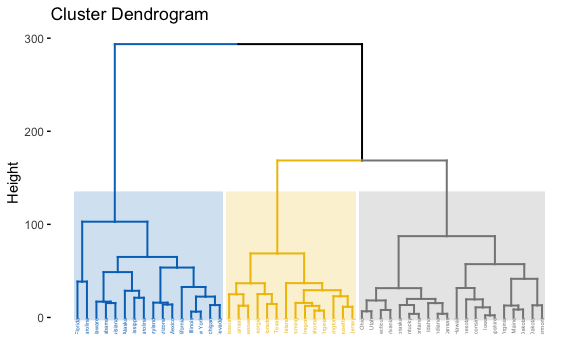
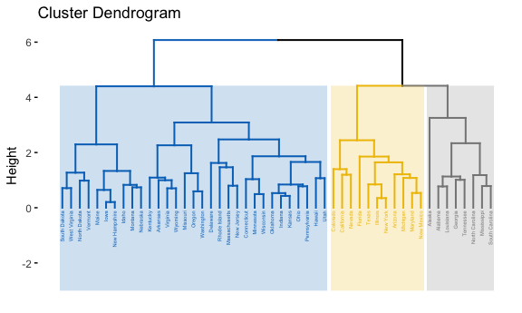

Data Science II Homewrk 5
================
Roxy Zhang
5/4/2022

``` r
knitr::opts_chunk$set(warning = FALSE, message = FALSE, 
                      fig.align = "center", cache = TRUE, 
                      fig.width = 6, fig.asp = 0.6, out.width = "90%")
theme_set(theme_minimal() + theme(legend.position = "bottom"))
```

## Data import and partition

``` r
auto = read_csv("auto.csv") %>% 
  janitor::clean_names() %>% 
  na.omit() %>% 
  distinct() %>% 
  mutate(
    cylinders = as.factor(cylinders),
    origin = case_when(origin == "1" ~ "American",
                       origin == "2" ~ "European",
                       origin == "3" ~ "Japanese"),
    origin = as.factor(origin),
    mpg_cat = as.factor(mpg_cat),
    mpg_cat = fct_relevel(mpg_cat, "low", "high")
  ) %>% 
  as.data.frame()

skimr::skim_without_charts(auto)
```

|                                                  |      |
|:-------------------------------------------------|:-----|
| Name                                             | auto |
| Number of rows                                   | 392  |
| Number of columns                                | 8    |
| \_\_\_\_\_\_\_\_\_\_\_\_\_\_\_\_\_\_\_\_\_\_\_   |      |
| Column type frequency:                           |      |
| factor                                           | 3    |
| numeric                                          | 5    |
| \_\_\_\_\_\_\_\_\_\_\_\_\_\_\_\_\_\_\_\_\_\_\_\_ |      |
| Group variables                                  | None |

Data summary

**Variable type: factor**

| skim_variable | n_missing | complete_rate | ordered | n_unique | top_counts                  |
|:--------------|----------:|--------------:|:--------|---------:|:----------------------------|
| cylinders     |         0 |             1 | FALSE   |        5 | 4: 199, 8: 103, 6: 83, 3: 4 |
| origin        |         0 |             1 | FALSE   |        3 | Ame: 245, Jap: 79, Eur: 68  |
| mpg_cat       |         0 |             1 | FALSE   |        2 | low: 196, hig: 196          |

**Variable type: numeric**

| skim_variable | n_missing | complete_rate |    mean |     sd |   p0 |     p25 |    p50 |     p75 |   p100 |
|:--------------|----------:|--------------:|--------:|-------:|-----:|--------:|-------:|--------:|-------:|
| displacement  |         0 |             1 |  194.41 | 104.64 |   68 |  105.00 |  151.0 |  275.75 |  455.0 |
| horsepower    |         0 |             1 |  104.47 |  38.49 |   46 |   75.00 |   93.5 |  126.00 |  230.0 |
| weight        |         0 |             1 | 2977.58 | 849.40 | 1613 | 2225.25 | 2803.5 | 3614.75 | 5140.0 |
| acceleration  |         0 |             1 |   15.54 |   2.76 |    8 |   13.78 |   15.5 |   17.02 |   24.8 |
| year          |         0 |             1 |   75.98 |   3.68 |   70 |   73.00 |   76.0 |   79.00 |   82.0 |

``` r
# split the dataset into two parts: training data (70%) and test data (30%)

set.seed(0504)

indexTrain = createDataPartition(y = auto$mpg_cat,
                                 p = 0.7,
                                 list = FALSE)
```

## Support Vector Machines

### Linear Kernel

Fit a support vector classifier (linear kernel) to the training data.
The linear kernel provides a linear decision boundary.

``` r
set.seed(0504)

# using package e1071
linear_svm = tune.svm(mpg_cat ~ .,
                      data = auto[indexTrain, ],
                      kernel = "linear",
                      cost = exp(seq(-5, 2, len = 50)),
                      scale = TRUE)

# plot misclassification error based on cross validation against tuning parameter(cost)
plot(linear_svm)
```


``` r
# optimal tuning parameter with minimum cross-validation error
linear_svm$best.parameters
```

    ##         cost
    ## 29 0.3678794

``` r
# best model
best_linear_svm = linear_svm$best.model
summary(best_linear_svm)
```

    ## 
    ## Call:
    ## best.svm(x = mpg_cat ~ ., data = auto[indexTrain, ], cost = exp(seq(-5, 
    ##     2, len = 50)), kernel = "linear", scale = TRUE)
    ## 
    ## 
    ## Parameters:
    ##    SVM-Type:  C-classification 
    ##  SVM-Kernel:  linear 
    ##        cost:  0.3678794 
    ## 
    ## Number of Support Vectors:  70
    ## 
    ##  ( 34 36 )
    ## 
    ## 
    ## Number of Classes:  2 
    ## 
    ## Levels: 
    ##  low high

From the results above, the optimum tuning parameter is achieved when
cost is 0.368, which minimizes the cross-validation error.

``` r
# calculate training error rate from confusion matrix
confusionMatrix(data = linear_svm$best.model$fitted, 
                reference = auto$mpg_cat[indexTrain])
```

    ## Confusion Matrix and Statistics
    ## 
    ##           Reference
    ## Prediction low high
    ##       low  121    8
    ##       high  17  130
    ##                                           
    ##                Accuracy : 0.9094          
    ##                  95% CI : (0.8692, 0.9405)
    ##     No Information Rate : 0.5             
    ##     P-Value [Acc > NIR] : <2e-16          
    ##                                           
    ##                   Kappa : 0.8188          
    ##                                           
    ##  Mcnemar's Test P-Value : 0.1096          
    ##                                           
    ##             Sensitivity : 0.8768          
    ##             Specificity : 0.9420          
    ##          Pos Pred Value : 0.9380          
    ##          Neg Pred Value : 0.8844          
    ##              Prevalence : 0.5000          
    ##          Detection Rate : 0.4384          
    ##    Detection Prevalence : 0.4674          
    ##       Balanced Accuracy : 0.9094          
    ##                                           
    ##        'Positive' Class : low             
    ## 

Accuracy is 90.94%, therefore training error rate is 9.06%. We can also
do the calculation: the optimal linear support vector classifier with
linear kernel incorrectly classifies 25 out of 276 training
observations, giving a 9.06% error rate.

``` r
set.seed(0504)

linear_svm_pred = predict(best_linear_svm, newdata = auto[-indexTrain, ])

# calculate test error rate from confusion matrix
confusionMatrix(data = linear_svm_pred, 
                reference = auto$mpg_cat[-indexTrain])
```

    ## Confusion Matrix and Statistics
    ## 
    ##           Reference
    ## Prediction low high
    ##       low   51    3
    ##       high   7   55
    ##                                           
    ##                Accuracy : 0.9138          
    ##                  95% CI : (0.8472, 0.9579)
    ##     No Information Rate : 0.5             
    ##     P-Value [Acc > NIR] : <2e-16          
    ##                                           
    ##                   Kappa : 0.8276          
    ##                                           
    ##  Mcnemar's Test P-Value : 0.3428          
    ##                                           
    ##             Sensitivity : 0.8793          
    ##             Specificity : 0.9483          
    ##          Pos Pred Value : 0.9444          
    ##          Neg Pred Value : 0.8871          
    ##              Prevalence : 0.5000          
    ##          Detection Rate : 0.4397          
    ##    Detection Prevalence : 0.4655          
    ##       Balanced Accuracy : 0.9138          
    ##                                           
    ##        'Positive' Class : low             
    ## 

Accuracy is 91.38%, therefore test error rate is 8.62%. Calculation by
hand: the classifier incorrectly classifies 10 out of 116 observations,
giving a 8.62% error rate.

### Radial Kernel

Fit a support vector machine with a radial kernel to the training data.
This gives a nonlinear decision boundary.

``` r
set.seed(0504)

# using package e1071
radial_svm = tune.svm(mpg_cat ~ .,
                      data = auto[indexTrain, ],
                      kernel = "radial",
                      cost = exp(seq(-3, 8, len = 50)),
                      gamma = exp(seq(-4, 4, len = 20)),
                      scale = TRUE)

plot(radial_svm, transform.y = log, transform.x = log, color.palette = terrain.colors)
```


``` r
radial_svm$best.parameters
```

    ##         gamma     cost
    ## 348 0.3490181 2.262175

``` r
best_radial_svm = radial_svm$best.model
summary(radial_svm$best.model)
```

    ## 
    ## Call:
    ## best.svm(x = mpg_cat ~ ., data = auto[indexTrain, ], gamma = exp(seq(-4, 
    ##     4, len = 20)), cost = exp(seq(-3, 8, len = 50)), kernel = "radial", 
    ##     scale = TRUE)
    ## 
    ## 
    ## Parameters:
    ##    SVM-Type:  C-classification 
    ##  SVM-Kernel:  radial 
    ##        cost:  2.262175 
    ## 
    ## Number of Support Vectors:  91
    ## 
    ##  ( 46 45 )
    ## 
    ## 
    ## Number of Classes:  2 
    ## 
    ## Levels: 
    ##  low high

From the results above, the optimum tuning parameter is achieved when
gamma is 0.349 cost is 2.262, which minimizes the cross-validation
error.

``` r
# calculate training error rate from confusion matrix
confusionMatrix(data = radial_svm$best.model$fitted, 
                reference = auto$mpg_cat[indexTrain])
```

    ## Confusion Matrix and Statistics
    ## 
    ##           Reference
    ## Prediction low high
    ##       low  130    6
    ##       high   8  132
    ##                                          
    ##                Accuracy : 0.9493         
    ##                  95% CI : (0.9164, 0.972)
    ##     No Information Rate : 0.5            
    ##     P-Value [Acc > NIR] : <2e-16         
    ##                                          
    ##                   Kappa : 0.8986         
    ##                                          
    ##  Mcnemar's Test P-Value : 0.7893         
    ##                                          
    ##             Sensitivity : 0.9420         
    ##             Specificity : 0.9565         
    ##          Pos Pred Value : 0.9559         
    ##          Neg Pred Value : 0.9429         
    ##              Prevalence : 0.5000         
    ##          Detection Rate : 0.4710         
    ##    Detection Prevalence : 0.4928         
    ##       Balanced Accuracy : 0.9493         
    ##                                          
    ##        'Positive' Class : low            
    ## 

Accuracy is 94.93%, therefore training error rate is 5.07%. We can also
do the calculation: the optimal linear support vector classifier with
radial kernel incorrectly classifies 14 out of 276 training
observations, giving a 5.07% error rate.

``` r
set.seed(0504)

radial_svm_pred = predict(best_radial_svm, newdata = auto[-indexTrain, ])

# calculate test error rate from confusion matrix
confusionMatrix(data = radial_svm_pred, 
                reference = auto$mpg_cat[-indexTrain])
```

    ## Confusion Matrix and Statistics
    ## 
    ##           Reference
    ## Prediction low high
    ##       low   56    1
    ##       high   2   57
    ##                                           
    ##                Accuracy : 0.9741          
    ##                  95% CI : (0.9263, 0.9946)
    ##     No Information Rate : 0.5             
    ##     P-Value [Acc > NIR] : <2e-16          
    ##                                           
    ##                   Kappa : 0.9483          
    ##                                           
    ##  Mcnemar's Test P-Value : 1               
    ##                                           
    ##             Sensitivity : 0.9655          
    ##             Specificity : 0.9828          
    ##          Pos Pred Value : 0.9825          
    ##          Neg Pred Value : 0.9661          
    ##              Prevalence : 0.5000          
    ##          Detection Rate : 0.4828          
    ##    Detection Prevalence : 0.4914          
    ##       Balanced Accuracy : 0.9741          
    ##                                           
    ##        'Positive' Class : low             
    ## 

Accuracy is 97.41%, therefore test error rate is 2.59%. Calculation by
hand: the classifier incorrectly classifies 3 out of 116 observations,
giving a 2.59% error rate.

For support vector machine with radial kernel, the training and test
error rate are both lower than that of svm with linear kernel. So the
model with radial kernel performs better.

## Hierachical Clustering

### Without scaling

``` r
data(USArrests)

arrests = USArrests %>% as.data.frame()

dim(arrests)
```

    ## [1] 50  4

``` r
skimr::skim_without_charts(arrests)
```

|                                                  |         |
|:-------------------------------------------------|:--------|
| Name                                             | arrests |
| Number of rows                                   | 50      |
| Number of columns                                | 4       |
| \_\_\_\_\_\_\_\_\_\_\_\_\_\_\_\_\_\_\_\_\_\_\_   |         |
| Column type frequency:                           |         |
| numeric                                          | 4       |
| \_\_\_\_\_\_\_\_\_\_\_\_\_\_\_\_\_\_\_\_\_\_\_\_ |         |
| Group variables                                  | None    |

Data summary

**Variable type: numeric**

| skim_variable | n_missing | complete_rate |   mean |    sd |   p0 |    p25 |    p50 |    p75 |  p100 |
|:--------------|----------:|--------------:|-------:|------:|-----:|-------:|-------:|-------:|------:|
| Murder        |         0 |             1 |   7.79 |  4.36 |  0.8 |   4.08 |   7.25 |  11.25 |  17.4 |
| Assault       |         0 |             1 | 170.76 | 83.34 | 45.0 | 109.00 | 159.00 | 249.00 | 337.0 |
| UrbanPop      |         0 |             1 |  65.54 | 14.47 | 32.0 |  54.50 |  66.00 |  77.75 |  91.0 |
| Rape          |         0 |             1 |  21.23 |  9.37 |  7.3 |  15.08 |  20.10 |  26.17 |  46.0 |

``` r
# hierarchical clustering with complete linkage and Euclidean distance (without scaling)
hc = hclust(dist(arrests), method = "complete")
```

``` r
# cut the dendrogram at a height that results in three distinct clusters
fviz_dend(hc, k = 3,    
          cex = 0.3, 
          palette = "jco",
          color_labels_by_k = TRUE,
          rect = TRUE, rect_fill = TRUE, rect_border = "jco",
          labels_track_height = 2.5)
```



The cluster on the left includes some populous states, such as New York,
California, Florida, North Carolina, Illinois, etc.  
The middle cluster includes some Southern states, such as Missouri,
Arkansas, Tennessee, but also some others, like Washington,
Massachusetts and New Jersey. The cluster on the right contains some
less populous states, like Ohio, Utah, Kentucky, and others.  
There seems not be any clear pattern pattern of the clustering based on
geography, but there might be some grouping tendencies based on
population of the states.

### With scaling

``` r
# scale and center data
arrests_scaled = scale(arrests, center = TRUE, scale = TRUE)

# hierarchical clustering with complete linkage and Euclidean distance
hc_scaled = hclust(dist(arrests_scaled), method = "complete")
```

``` r
# cut the dendrogram at a height that results in three distinct clusters
fviz_dend(hc_scaled, k = 3,    
          cex = 0.3, 
          palette = "jco",
          color_labels_by_k = TRUE,
          rect = TRUE, rect_fill = TRUE, rect_border = "jco",
          labels_track_height = 2.5)
```



We can see that there are more states in the left cluster than other 2
clusters. And the distribution of the states is quite different from the
dendrogram without clustering.

### Discussion

Scaling the variables change the clustering results.

With scaling, one cluster contains South Dakota, West Virginia, any many
other of the less populous states; another cluster contains California,
Nevada, Texas, New York, and primarily more populous states in major
urban metro areas; and a third cluster with Alaska, Alabama, Louisiana,
Georgia, and a number of other mostly Southern U.S. states. This is
quite different from the dendrogram plotted without scaling.

This is because the clustering algorithms requires the method of
calculating distance to be specified, as we are using Euclidean distance
here. Without scaling numeric variables, the variables with greater
magnitudes might be put more importance. In this case, if we do the
classification without scaling, we’re more likely to cluster based on
`assault` than other variables, since it has greater values.

In my opinion, the variables should be scaled before the
inter-observation dissimilarities are computed in order to ensure the
variables are of comparable units.
